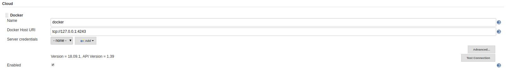
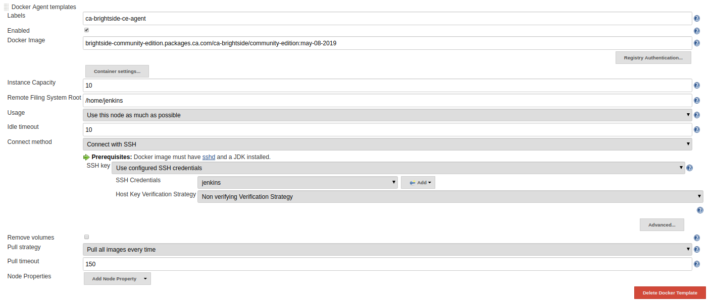

## Install Docker
[https://docs.docker.com/install/](https://docs.docker.com/install/)

## Install Jenkins 
[https://jenkins.io/doc/book/installing/](https://jenkins.io/doc/book/installing/)

## Install Jenkins Docker Plugins
Jenkins -> Manage Plugins -> Install Docker Plugin

Note: This should also install Docker Commons and Docker Pipeline Plugins.

Docker Plugin: [https://plugins.jenkins.io/docker-plugin](https://plugins.jenkins.io/docker-plugin)

Docker Commons Plugin: [https://plugins.jenkins.io/docker-commons](https://plugins.jenkins.io/docker-commons)

Docker Pipeline Plugin: [https://plugins.jenkins.io/docker-workflow](https://plugins.jenkins.io/docker-workflow)

## Using Docker with Jenkins Pipeline

General documentation on Using Docker with Pipeline: [https://jenkins.io/doc/book/pipeline/docker/](https://jenkins.io/doc/book/pipeline/docker/)

Configure Jenkins to connect to Docker. Below is guidance for configuration on a Linux host.

Process for using systemd to control the Docker daemon on Linux hosts: [https://success.docker.com/article/using-systemd-to-control-the-docker-daemon](https://success.docker.com/article/using-systemd-to-control-the-docker-daemon)

  - To update the docker host daemon to listen on tcp port 4243:
  - Issue "systemctl status docker" command to locate where the docker.service file is located. I.E. /usr/lib/systemd/system/docker.service
  - Issue "systemctl stop docker" command to stop the running docker daemon.
  - Open and edit docker.service file.
  - Locate line that contain "ExecStart=" string
  - Add "-H unix:///var/run/docker.sock -H tcp://0.0.0.0:4243"
  - Save the change to docker.service file.
  - Issue "systemctl daemon-reload" command to load the updated docker.service file.
  - Issue "systemctl start docker" restart docker daemon.
  - Issue "systemctl status docker" command and make sure that docker is running and TCP port 4243 is now open and listening.

To ensure Jenkins can reach the docker host, navigate to Jenkins -> Configure System and locate the Cloud Docker settings. If Docker and Jenkins are running on the same host, adjust the Docker Host URI to `tcp://127.0.0.1:4243` and click the `Test Connection` button. You should see the Version and API Version displayed. You can verify this matches the docker instance on your machine by issuing the `docker version` command.

Then, to use the Brightside Community Edition Docker Image you will need to create the appropriate Docker Agent Template.
Click `Docker Agent templates...` and then click `Add Docker Template`.

Next, fill out the template properties as you desire.

The Docker Image in our case is `brightside-community-edition.packages.ca.com/ca-brightside/community-edition:may-08-2019`

You can view the available tags beyond may-08-2019 at [https://bintray.com/ca/brightside-community-edition/ca-brightside%3Acommunity-edition](https://bintray.com/ca/brightside-community-edition/ca-brightside%3Acommunity-edition)

This docker image has a sshd and JDK installed so that we can connect over SSH.

An example of our configuration for this exercise is shown below.
